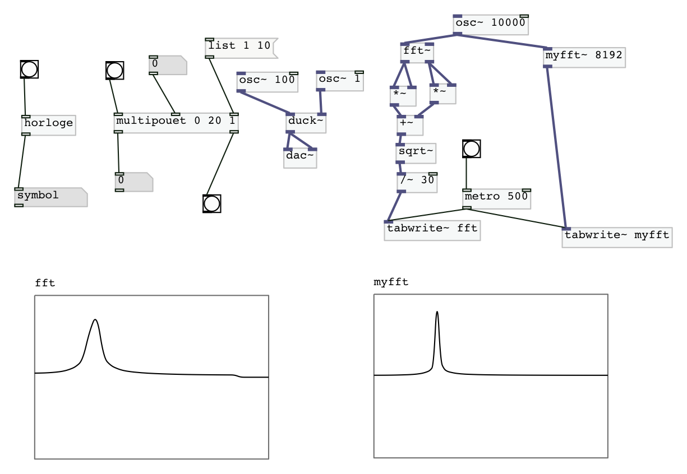

# Exercises-PureData

Here you can find some pd externals coded in C for a class validation at IRCAM, ATIAM master's degree dipensed by Mr. Philippe Esling.

## Getting Started

### Dependencies

We splitted the exercices in two parts : Tools and Instrument, each corresponding folder has a proper Makefile.

Some mandatory files are in other gits (puredata and pd-lib-builder) so if you want to use our Makefile, please git clone the corresponding gits. So to get started, go to a directory you want to have our projet into and do the following : 

      git clone https://github.com/GuiMarion/Exercises-PureData.git
      
      cd Exercises-PureData
 
      git clone https://github.com/pure-data/pure-data
     
      git clone https://github.com/pure-data/pd-lib-builder.git
      
Now, you have everything you need to compile our externals, just make sure you have pd installed. Note that for some reasons our externals doesn't work with pd vanilla on MacOs, so if you want to use them on your mac please use pd-extended.

### Compile

To compile our externals, you can use our Makefile, to do so please go to the corresponding directory, for exemple, 

      cd Part1_Tools
      
And type make, 

      make
     
Depending on your os, you should have the corresponding librairy, if you want to test ou externals, you can use our pd script. If you using MacOs, the open command can be very useful, 

     open main.pd
     
This is what you should see.

