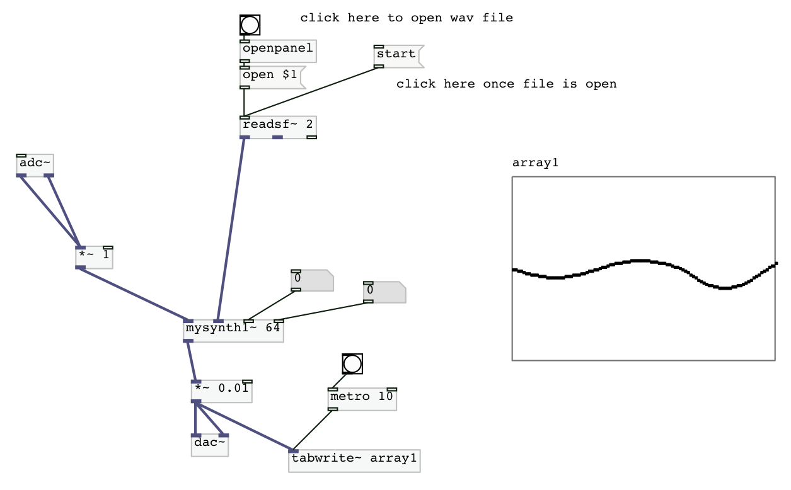

# Exercises-PureData

Here you can find some pd externals coded in C for a class validation at IRCAM, ATIAM master's degree dipensed by Mr. Philippe Esling.

## Getting Started

### Dependencies

We splitted the exercices in two parts : Tools and Instruments, each corresponding folder has a proper Makefile.

Some mandatory files are in other gits (puredata and pd-lib-builder) so if you want to use our Makefile, please git clone the corresponding gits. So to get started, go to a directory you want to have our projet into and do the following : 

      git clone https://github.com/GuiMarion/Exercises-PureData.git
      
      cd Exercises-PureData
 
      git clone https://github.com/pure-data/pure-data
     
      git clone https://github.com/pure-data/pd-lib-builder.git
      
Now, you have everything you need to compile our externals, just make sure you have pd installed. Note that for some reasons our externals doesn't work with pd vanilla on MacOs, so if you want to use them on your mac please use pd-extended.

### Compile

To compile our externals, you can use our Makefile, to do so, go to the corresponding directory, for exemple, 

      cd Part1_Tools
      
And type make, 

      make
     
You should get the librairies corresponding to your os, if you want to test our externals, you can use our pd script. If you using MacOs, the open command can be quit effecient, 

     open main.pd
     

## Part 1: Tools

The first part consists in making some tools for pd: a clock that gives the time, a multipouet that is a counter which we can change the step and the range, a duck effect, and an fft. This is what you should see when you open the main.

The myfft~ external uses a ring buffer in order to cmpute fft on different window size, independently of the pd buffer size. You can pass as parameter the windows size you want for fft computation, it should be a power of 2 betweeen 64 and 131072 (huge!! use it in purpose). By default, the value of 8192 will be used, this is the one we recommand. A windowing with a Blackman window is made on the input signal, the output signal from the fft is decimate in order to be send to pd outlet.

This is what you should see if you open the main pd script.

Note that myfft has a narrower pic than fft but can have have some secondary pics for low window size. We also replaced the outlet list of multipouet by a number for readibility reasons (the code is commented).

## Part2: Instruments

We implemented only two of the proposed instruments: Spectral Cross Synthesis and Shaping Cross Synthesis. In order to reduce the length of the signal computed from the buffer to the length of the pd buffer, we decimate the signal while we are in the frequency domain, so that we do not have too much problem with aliasing. This technique don't seems to be so effective, we will try to figure out a better one as improvement. We used the microphone and a wav file (click to import the one you want) to produce sound in our pd script. 

This is what you should see if you open the main pd script.

## Spetral Cross Synthesis

This first inlet is for the harmonicaly rich signal, the second for the carrier.
The third inlet is for the threshold, the fourth one is for bypass, put it to 1 if you want to hear only the first signal. Autonorm is activated by default, you can change this by changin the global variable at the top of mysyth1~.c.

## Shaping Cross Synthesis

This first inlet is for the harmonicaly rich signal, the second for the carrier.
The third inlet is for the shape width, that should intensifiate the effect, the fourth one is for bypass, put it to 1 if you want to hear only the first signal.

## Licence

Everything in this repository is free, you can use it for any purpose as long as you cite the repository somewhere.
For any request or question, feel free to contact me.
